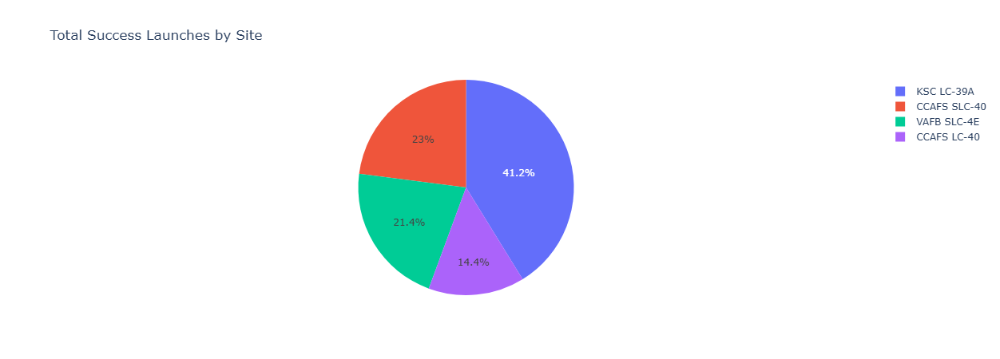
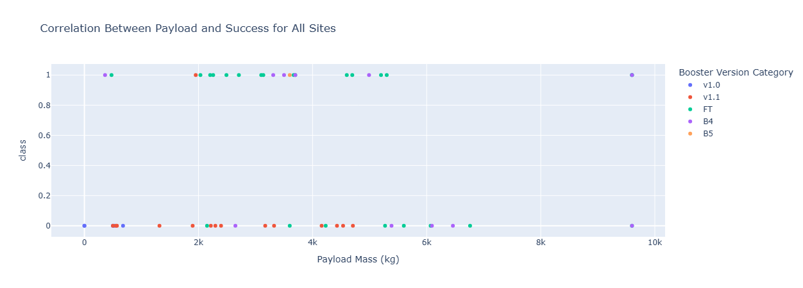

# 🚀 SpaceX Falcon 9 Landing Success Prediction

### IBM Applied Data Science Capstone | End-to-End Data Science & Machine Learning Project

> **Business Question:** Can historical launch characteristics predict whether a Falcon 9 first-stage booster will land successfully—and help assess the economics of reusable rocket launches?

Built an end-to-end data science pipeline covering **REST API data collection, web scraping, data wrangling, SQL & Python EDA, geospatial analytics, interactive dashboard development, and machine learning classification**.

### 🏆 Project Result

**4 machine learning models compared → GridSearchCV hyperparameter tuning → Decision Tree selected → 88.89% test accuracy**

| Project Area | Implementation |
|---|---|
| **Business Objective** | Predict Falcon 9 first-stage landing success |
| **Data Collection** | SpaceX REST API + Wikipedia Web Scraping |
| **Data Preparation** | JSON Normalization, Null Handling, Feature Engineering |
| **Exploratory Analysis** | SQL + Python |
| **Geospatial Analytics** | Folium Interactive Maps |
| **Interactive Dashboard** | Plotly Dash |
| **Machine Learning** | Logistic Regression, SVM, Decision Tree, KNN |
| **Model Optimization** | GridSearchCV |
| **Best Model** | **Decision Tree — 88.89% Test Accuracy** |

### 🛠️ Core Tech Stack

`Python` · `SQL` · `Pandas` · `NumPy` · `Scikit-learn` · `GridSearchCV` · `BeautifulSoup` · `REST API` · `Plotly Dash` · `Folium` · `Jupyter Notebook`

> **Project Context:** Completed as part of the **IBM Applied Data Science Capstone** within the IBM Data Science Professional Certificate. This is a scenario-based educational portfolio project and does not represent employment with IBM or SpaceX.

---
## 🎯 Business Problem

Commercial rocket launches are extremely expensive. In the IBM capstone scenario, **SpaceX advertises Falcon 9 launches at approximately $62 million**, while launches from other providers can cost **upwards of $165 million**.

A major contributor to SpaceX's cost advantage is its ability to **recover and reuse the Falcon 9 first-stage booster**.

Therefore, understanding whether the first stage is likely to land successfully can provide valuable insight into launch economics and reusable-launch operations.

### Project Objective

The objective of this project is to build an end-to-end data science solution that answers:

> **Can we predict whether the Falcon 9 first stage will land successfully using historical launch characteristics?**

To solve this problem, the project combines:

- SpaceX REST API data collection
- Wikipedia web scraping
- Data cleaning and wrangling
- SQL exploratory analysis
- Python data visualization
- Geospatial launch-site analysis
- Interactive Plotly Dash analytics
- Machine learning classification
- Hyperparameter tuning and model evaluation

The final output is a predictive classification workflow capable of distinguishing between **successful (`1`) and unsuccessful (`0`) first-stage landing outcomes**.

---
## 🎯 Business Problem

Commercial rocket launches are extremely expensive. In the IBM capstone scenario, **SpaceX advertises Falcon 9 launches at approximately $62 million**, while launches from other providers can cost **upwards of $165 million**.

A major contributor to SpaceX's cost advantage is its ability to **recover and reuse the Falcon 9 first-stage booster**.

Therefore, understanding whether the first stage is likely to land successfully can provide valuable insight into launch economics and reusable-launch operations.

### Project Objective

The objective of this project is to build an end-to-end data science solution that answers:

> **Can we predict whether the Falcon 9 first stage will land successfully using historical launch characteristics?**

To solve this problem, the project combines:

- SpaceX REST API data collection
- Wikipedia web scraping
- Data cleaning and wrangling
- SQL exploratory analysis
- Python data visualization
- Geospatial launch-site analysis
- Interactive Plotly Dash analytics
- Machine learning classification
- Hyperparameter tuning and model evaluation

The final output is a predictive classification workflow capable of distinguishing between **successful (`1`) and unsuccessful (`0`) first-stage landing outcomes**.

---
## 🔄 End-to-End Data Science Workflow

The project follows a structured data science lifecycle, progressing from raw data acquisition to predictive modeling and stakeholder-facing analytics.

### 1️⃣ Data Collection — SpaceX REST API
- Retrieved historical SpaceX launch data using Python `requests`.
- Worked with the SpaceX REST API `/v4/launches/past` endpoint.
- Converted nested JSON responses into structured Pandas DataFrames using `json_normalize`.
- Used additional API endpoints to retrieve information associated with boosters, launchpads, payloads, and cores.
- Filtered the collected records to focus on **Falcon 9 launches**.
- Replaced missing `PayloadMass` values using the mean while retaining meaningful `LandingPad` null values.

📓 [`01_Data-Collection-API.ipynb`](01_Data-Collection-API.ipynb)

### 2️⃣ Data Collection — Web Scraping
- Collected historical launch records from a snapshot of the Wikipedia **List of Falcon 9 and Falcon Heavy launches**.
- Used `Requests` and `BeautifulSoup` to retrieve and parse HTML.
- Extracted launch-table headers and individual launch records.
- Parsed fields including flight number, date, booster version, launch site, payload, payload mass, orbit, customer, launch outcome, and booster landing status.
- Converted the extracted records into a Pandas DataFrame for downstream analysis.

📓 [`02_Webscraping.ipynb`](02_Webscraping.ipynb)

### 3️⃣ Data Wrangling
- Cleaned and transformed the collected launch data.
- Examined launch attributes required for landing-success analysis.
- Converted landing outcomes into the supervised machine-learning target:
  - **1 = Successful Landing**
  - **0 = Unsuccessful Landing**
- Prepared the dataset for exploratory analysis and predictive modeling.

📓 [`03_Data_Wrangling.ipynb`](03_Data_Wrangling.ipynb)

### 4️⃣ Exploratory Data Analysis — SQL & Python
- Used **SQL** to investigate launch data and operational patterns.
- Used **Python visualization** to explore relationships between launch characteristics and landing success.
- Analyzed factors such as launch site, payload mass, orbit, and flight progression.
- Prepared categorical variables using **One-Hot Encoding** for machine-learning analysis.

📓 [`04-EDA-With-SQL.ipynb`](04-EDA-With-SQL.ipynb)  
📓 [`05_EDA_Data_Visualization.ipynb`](05_EDA_Data_Visualization.ipynb)

### 5️⃣ Geospatial Launch-Site Analysis
- Built interactive maps using **Folium**.
- Visualized launch-site locations and landing outcomes.
- Examined launch-site proximity to surrounding geographic features and infrastructure.
- Used spatial analysis to support reasoning about launch-site characteristics.

📓 [`06_Launch_Site_Location.ipynb`](06_Launch_Site_Location.ipynb)

### 6️⃣ Interactive Analytics Dashboard
- Developed an interactive web application using **Plotly Dash**.
- Added launch-site selection through a dropdown filter.
- Built launch-success pie-chart analysis.
- Added an interactive payload-mass range slider.
- Created payload mass vs. landing-success scatter analysis.
- Implemented reactive Dash callbacks to update visualizations based on user selections.

💻 [`07_Dashapp.py`](07_Dashapp.py)

### 7️⃣ Machine Learning & Predictive Analysis
- Standardized model input features.
- Split the dataset into training and testing sets.
- Trained **4 classification algorithms**:
  - Logistic Regression
  - Support Vector Machine (SVM)
  - Decision Tree Classifier
  - K-Nearest Neighbors (KNN)
- Performed hyperparameter optimization using **GridSearchCV**.
- Evaluated optimized models on the test dataset.
- Used confusion-matrix analysis for classification evaluation.
- Selected the strongest model based on observed test accuracy.

📓 [`08_Machine_Learning_Predictions.ipynb`](08_Machine_Learning_Predictions.ipynb)

---
## 🔍 Key Analytical Findings

The exploratory and visual analysis identified several patterns associated with Falcon 9 first-stage landing performance:

- **Landing success improved over time**, indicating that flight progression and accumulated launch experience were associated with stronger landing outcomes in the analyzed data.
- **Launch sites showed different landing success rates**, making launch location a relevant feature for predictive analysis.
- The course analysis observed approximately **60% success at CCAFS LC-40**, compared with around **77% at KSC LC-39A and VAFB SLC-4E**.
- **Payload mass and launch site interacted with landing outcomes**. For example, the analyzed course data showed CCAFS LC-40 launches above 10,000 kg with a 100% success rate in that observed subset.
- **Orbit type, payload characteristics, launch site, and other operational attributes** provided useful information for investigating landing success.
- Geospatial analysis demonstrated how launch-site locations and their proximity to surrounding infrastructure and geographic features can be explored interactively.
- These findings supported the decision to use **multiple launch characteristics together** rather than relying on a single variable for landing prediction.

### 💡 Analytical Takeaway

The EDA suggested that Falcon 9 landing success is associated with a **combination of operational, geographic, and mission characteristics**. These relationships provided the analytical foundation for the subsequent machine-learning classification stage.

---
## 📊 Interactive Analytics Dashboard

To make the launch analysis accessible beyond static notebooks, I developed an interactive **Plotly Dash application** for exploring Falcon 9 launch performance.

### Dashboard Capabilities

- Filter results by **launch site**
- Compare **successful launches across sites**
- Analyze **success vs. failure** for individual launch sites
- Filter launches by **payload mass range**
- Explore the relationship between **payload mass and landing success**
- Compare results across **booster version categories**
- Dynamically update visualizations through Dash callbacks

<table border="0" width="100%">
<tr>
    <th align="center" width="50%">Launch Site Success Analysis</th>
    <th align="center" width="50%">Payload Mass vs. Landing Success</th>
</tr>
<tr>
    <td align="center">
        
    </td>
    <td align="center">
        
    </td>
</tr>
</table>

### 💼 Business Value

The dashboard converts analytical results into an **interactive decision-support interface**, allowing stakeholders to investigate launch-site performance and payload-related landing patterns without directly working with the underlying code.

💻 [`07_Dashapp.py`](07_Dashapp.py)

---
## 🤖 Machine Learning Model Performance

Four classification algorithms were trained and optimized to predict whether the Falcon 9 first-stage booster would land successfully.

To ensure a consistent comparison, the models were tuned using **GridSearchCV** and evaluated using the same train/test framework.

| Classification Model | Training Accuracy | Test Accuracy |
|---|---:|---:|
| **Decision Tree Classifier** | **87.50%** | **88.89%** |
| K-Nearest Neighbors (KNN) | 84.82% | 83.33% |
| Support Vector Machine (SVM) | 84.82% | 83.33% |
| Logistic Regression | 84.64% | 83.33% |

### 🏆 Best Performing Model

**Decision Tree Classifier — 88.89% Test Accuracy**

Best hyperparameters identified through `GridSearchCV`:

```python
{
    "criterion": "gini",
    "max_depth": 8,
    "max_features": "sqrt",
    "min_samples_leaf": 1,
    "min_samples_split": 5,
    "splitter": "random"
}

## 🛠️ Technology Stack

| Area | Technologies & Methods |
|---|---|
| **Programming** | Python |
| **Data Analysis** | Pandas, NumPy, SQL |
| **Data Collection** | REST API, Requests, JSON, Web Scraping |
| **Web Scraping** | BeautifulSoup4, HTML Parsing |
| **Data Preparation** | Data Wrangling, Null Handling, Feature Engineering |
| **Visualization** | Matplotlib, Seaborn, Plotly |
| **Geospatial Analytics** | Folium |
| **Interactive Analytics** | Plotly Dash, Dash Callbacks |
| **Machine Learning** | Scikit-learn, Classification |
| **Model Optimization** | GridSearchCV, Hyperparameter Tuning |
| **Model Evaluation** | Train/Test Split, Accuracy, Confusion Matrix |
| **Development Environment** | Jupyter Notebook |

### 💼 Skills Demonstrated

**Data Acquisition & Engineering**
- REST API integration and JSON normalization
- Web scraping and HTML table parsing
- Data cleaning, transformation, and null-value handling
- Feature preparation for machine learning

**Analytics & Visualization**
- SQL-based exploratory data analysis
- Python exploratory data analysis
- Statistical and visual pattern discovery
- Interactive geospatial analysis
- Stakeholder-oriented dashboard development

**Machine Learning**
- Binary classification
- Feature preprocessing and standardization
- One-hot encoding
- Logistic Regression
- Support Vector Machine
- Decision Tree Classification
- K-Nearest Neighbors
- GridSearchCV hyperparameter optimization
- Model comparison and evaluation

**Business & Communication**
- Translating a business problem into an analytical objective
- Connecting exploratory findings to predictive modeling
- Building interactive decision-support visualizations
- Comparing model performance using measurable results
- Communicating technical findings through a final capstone presentation

---
## 📂 Repository Structure

```text
Applied-Data-Science-Capstone/
│
├── data/
│   ├── 1_dataset_part_1.csv
│   ├── 2_spacex_web_scraped.csv
│   ├── 3_dataset_part_2.csv
│   ├── spacex_launch_dash.csv
│   ├── pie_chart.png
│   └── scatter_plot.png
│
├── 01_Data-Collection-API.ipynb
├── 02_Webscraping.ipynb
├── 03_Data_Wrangling.ipynb
├── 04-EDA-With-SQL.ipynb
├── 05_EDA_Data_Visualization.ipynb
├── 06_Launch_Site_Location.ipynb
├── 07_Dashapp.py
├── 08_Machine_Learning_Predictions.ipynb
├── 09_Capstone_Final_Presentation.pdf
├── requirements.txt
├── LICENSE
└── README.md
```

### 🔎 Quick Navigation by Skill

| Want to Review | File |
|---|---|
| **REST API / Data Collection** | [`01_Data-Collection-API.ipynb`](01_Data-Collection-API.ipynb) |
| **Web Scraping** | [`02_Webscraping.ipynb`](02_Webscraping.ipynb) |
| **Data Wrangling** | [`03_Data_Wrangling.ipynb`](03_Data_Wrangling.ipynb) |
| **SQL Analysis** | [`04-EDA-With-SQL.ipynb`](04-EDA-With-SQL.ipynb) |
| **Python EDA** | [`05_EDA_Data_Visualization.ipynb`](05_EDA_Data_Visualization.ipynb) |
| **Geospatial Analytics** | [`06_Launch_Site_Location.ipynb`](06_Launch_Site_Location.ipynb) |
| **Interactive Dashboard** | [`07_Dashapp.py`](07_Dashapp.py) |
| **Machine Learning** | [`08_Machine_Learning_Predictions.ipynb`](08_Machine_Learning_Predictions.ipynb) |
| **Final Presentation** | [`09_Capstone_Final_Presentation.pdf`](09_Capstone_Final_Presentation.pdf) |

---
## 🚀 Getting Started

### 1. Clone the Repository

```bash
git clone https://github.com/usmanali9999/Applied-Data-Science-Capstone.git
cd Applied-Data-Science-Capstone
```

### 2. Install Dependencies

```bash
pip install -r requirements.txt
```

### 3. Launch Jupyter Notebook

```bash
jupyter notebook
```

Run the notebooks sequentially to follow the end-to-end workflow:

```text
01 → API Data Collection
02 → Web Scraping
03 → Data Wrangling
04 → SQL EDA
05 → Python EDA & Visualization
06 → Geospatial Analysis
07 → Interactive Dash Application
08 → Machine Learning & Model Evaluation
```

### 4. Run the Interactive Dashboard

```bash
python 07_Dashapp.py
```

The Dash application is configured to run locally on **port 7070**.

### 5. Review the Final Presentation

For a concise overview of the complete project, methodology, and machine-learning results:

📄 [`09_Capstone_Final_Presentation.pdf`](09_Capstone_Final_Presentation.pdf)

---
## 🎓 Project Context

This project was completed as part of the **IBM Applied Data Science Capstone**, within the **IBM Data Science Professional Certificate**.

The capstone provided a scenario-based business problem centered on predicting **SpaceX Falcon 9 first-stage landing success**. The repository demonstrates the practical application of data collection, data wrangling, SQL, exploratory analysis, interactive visualization, geospatial analytics, and machine learning within an end-to-end data science workflow.

> **Disclaimer:** This is an educational portfolio project completed through the IBM Data Science Professional Certificate curriculum. It does not represent employment, consulting work, or an official project performed for IBM or SpaceX.

---

## 👤 Author

### Muhammad Usman Ali

Data Analyst / Data Science Portfolio

- **GitHub:** [usmanali9999](https://github.com/usmanali9999)
- **LinkedIn:** [linkedin.com/in/usmanali9999](https://www.linkedin.com/in/usmanali9999)

---

## 📄 License

This project is distributed under the **MIT License**. See [`LICENSE`](LICENSE) for details.

---

### ⭐ If you found this project useful, consider starring the repository.
